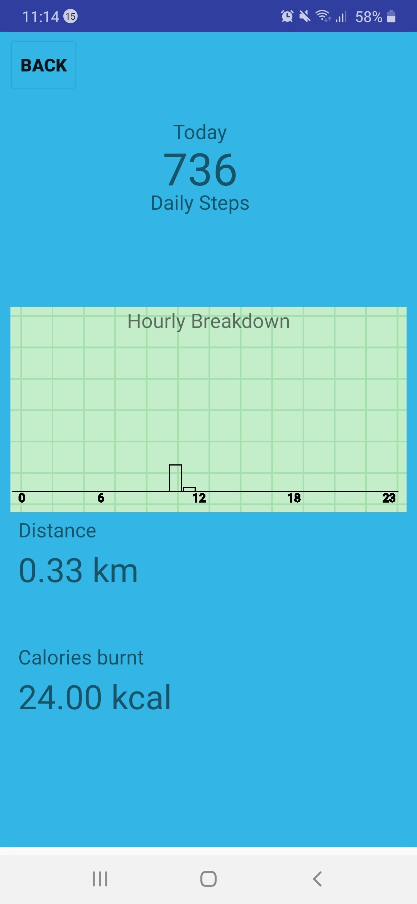

# Remote-Fitness-Monitoring-Mobile-App

## Home

## functions

# Remote monitoring

MSc Project, Health and Fitness Monitoring Mobile App that is linked to PC Software to perform data analysis. Written in native Java.

#Main Features 
## Device connection: 
This feature allows a user to search for available fitness devices
and connect the app. A filtered search is implemented so other Bluetooth devices are
ignored.
## Daily workout analysis: 
A histogram plotter has been implemented to display
analysis results of the number of steps the user took in specific hours of the day.
## Walking/Running target setting: 
A set target option has been implemented which
includes a Googlemap interface where the user can track his current location. The
target function allows the user to set goals based on timing, number of calories to be
burnt, distance to cover or number of steps to take. This is a handy feature in case of a
workout.
## Sleep Detection: 
A sleep detection algorithm has been implemented to detect when
a user is inactive at night between 9pm and 7am. The algorithm detects how many
hours the user was asleep.
## User Profile: 
A user profile activity has also been implemented, to allow the user
supply his/her personal details which include weight and height, this is useful in
calculating the number of calories burnt by an individual.
## Nearby Health Center Detection: 
This is an additional feature to the software,
useful in case where a user needs to visit a health centre, the software queries google
location API for the closest health centres available at any point within a 5km radius.
## Social Distancing Sensor: 
An ultrasonic sensor (SRF02) has been integrated to detect object within 1metre distance. The sensor can be activated or deactivated from the app.
